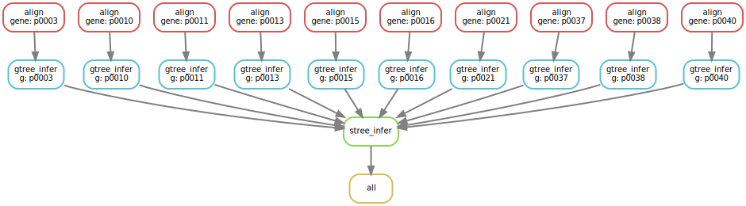

Our snakemake workflow may not too complicated, but your future projects will be complicated (and hopefully groundbreaking!). It would be nice to visualize the workflow. It's very easy to visualize a workflow with snakemake:

`snakemake --dag all -c 1 | dot -Tsvg > dag.svg`

The resulting figure is below

So far we were using RAxML installed in Expanse, which is loaded via `module load` statement. This means that our workflow won't run *off-the-shelf* in HPCs other than Expanse. One way to make your workflows reproducible is to use Docker (or Singularity). 
Snakemake is able to run your workflow within a Singularity container. Singularity is similar to Docker, but it does not require **sudo** to run a container. This feature makes it the preferred containarization tool in HPC. 
Singularity is already installed in expanse. Go ahead and run the following to activate singularity:

`module load singularitypro`

The coolest feature of singularity is that it supports Docker containers. Now we have to three options to containarize RAxML. We can create our own Singularity or Docker containers. Our we can simply pull one of the existing containers, which. I prefer:

[https://hub.docker.com](https://hub.docker.com)

This one seems like a good fit:

[https://hub.docker.com/r/chrishah/raxml-docker/](https://hub.docker.com/r/chrishah/raxml-docker/)

You can run a specific rule within a container using the following statement:

singularity: "docker://chrishah/raxml-docker:8.2.12"

We need to let snakemake know that some of the rules require singularity:

`snakemake --use-singularity -c 16 all`

During the first run, snakemake will pull the docker image, **convert** it to singularity image and cache it. This takes more than 5 minutes. So if you want to run this, keep that in mind. 
Luckily once it's cached (I ran this workflow before), activating an image takes only a couple of seconds.

